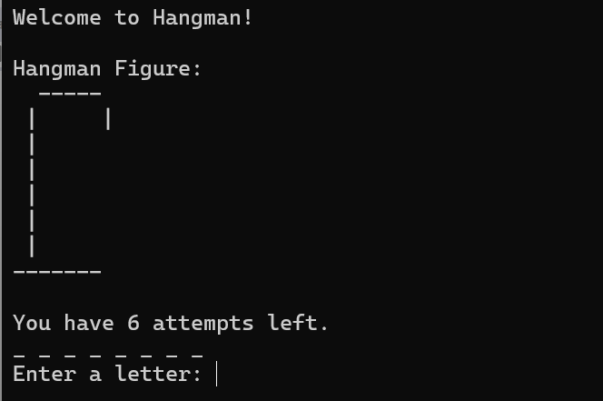
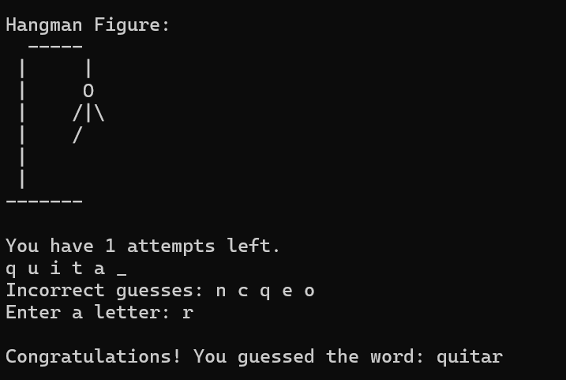
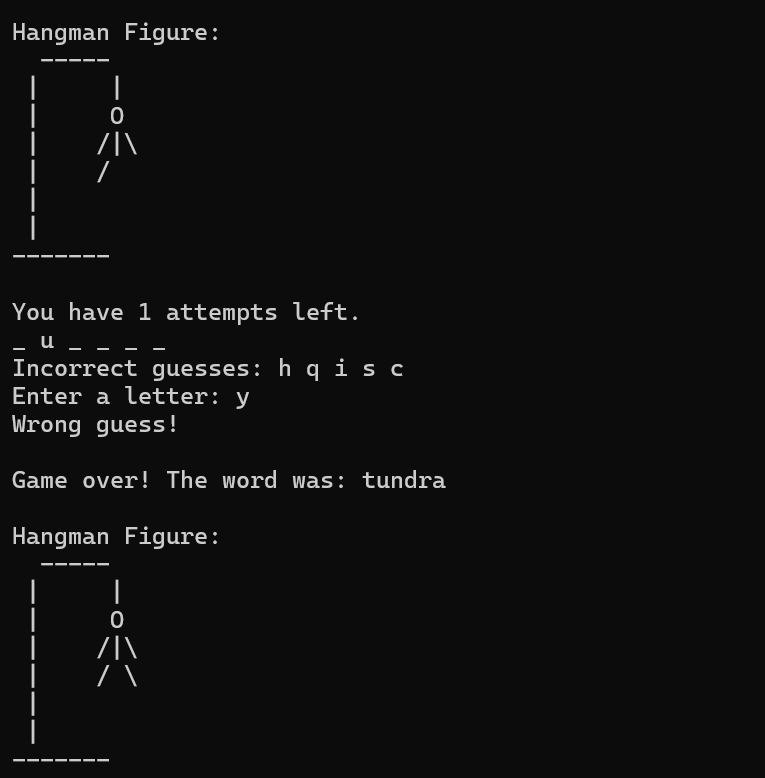

# 🎮 Hangman Game (C++)

## Overview

This is a console-based Hangman game developed in C++ as a university project. The game challenges players to guess a hidden word by entering one letter at a time before running out of attempts.

## Features

- Console-based gameplay
- Hidden word guessing
- Letter-by-letter input
- Win and lose conditions
- Simple and user-friendly interface

## Screenshots

### Main Menu

### Gameplay

### Win Screen

### Game Over

## Technologies Used

- C++
- Visual Studio 2022

## How to Run

1. Download or clone this repository.
2. Open the solution in Visual Studio.
3. Build the project.
4. Run the application.

## Learning Outcomes

This project helped me improve my understanding of:

- Functions
- Loops
- Conditional statements
- Arrays and strings
- Basic game logic
- Problem-solving in C++

## Author

**Fizzah Ahmed**  
Computer Science Student
